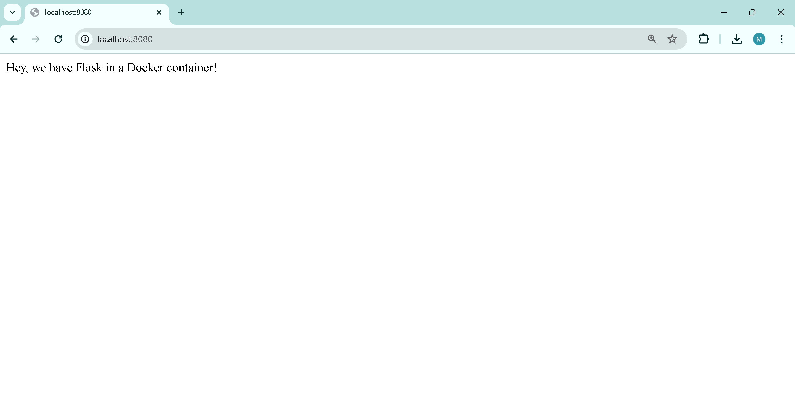

# Big Data HW02 flask_web

This repository contains files created while following the tutorial: <https://runnable.com/docker/python/dockerize-your-flask-application>, accessed by the [Wayback Machine](https://archive.org/). The image below demonstrates the successful viewing of the webpage from my local browser.

